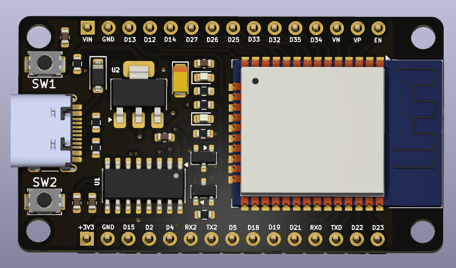
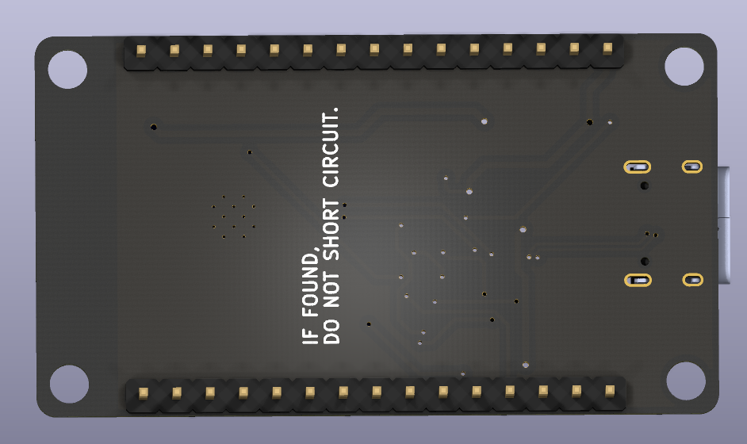
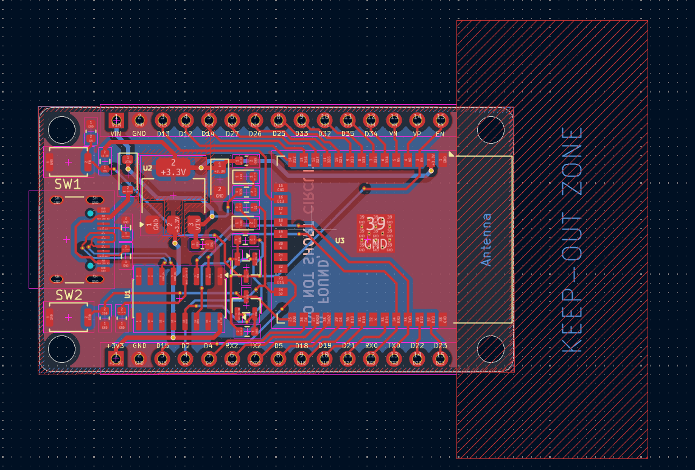
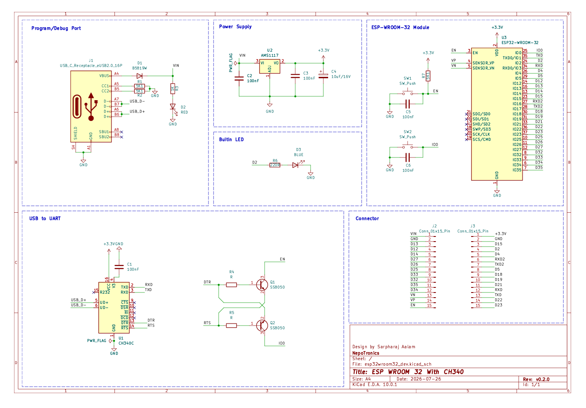

# ESP32-WROOM-32 Development Board — PCB Design

<p align="center">
  
</p>

<p align="center">
  <strong>Custom PCB Design for Embedded Systems and IoT Applications</strong>
</p>

<p align="center">
  
  
  
</p>

---

## 📌 Overview

This project presents a custom-designed **ESP32-WROOM-32 development board PCB** for embedded systems, electronics prototyping, and Internet of Things (IoT) applications.

The project includes PCB design visualizations, the circuit schematic, and a video demonstration. The board is designed around the ESP32-WROOM-32 module, which provides wireless connectivity and processing capabilities for a wide range of embedded applications.

This repository serves as a reference for understanding, reviewing, and further developing the PCB design.

## ✨ Features

* ESP32-WROOM-32-based development board.
* Wi-Fi and Bluetooth connectivity supported by the ESP32 module.
* Custom printed circuit board (PCB) layout.
* Circuit schematic for reviewing electrical connections.
* 3D PCB visualization for inspecting component placement.
* PCB design suitable for embedded systems and IoT prototyping.
* Design assets organized for convenient reference.

*Note: Actual board interfaces, power circuitry, and supported peripherals depend on the implemented schematic and component selection.*

---

## 📸 PCB Design Gallery

### 1. 3D Front View

The 3D front view provides a visual representation of the PCB and its component placement.

<p align="center">
  
</p>

### 2. 3D Back View

The back view helps inspect the reverse side of the PCB and its layout.

<p align="center">
  
</p>

### 3. PCB Layout

The PCB layout illustrates the board design, component arrangement, and routing.

<p align="center">
  
</p>

### 4. Circuit Schematic

The schematic provides an overview of the circuit connections and electronic components.

<p align="center">
  
</p>

---

## 🎥 Project Video Demonstration

Watch the PCB design demonstration to see the board visualization and design presentation.

<p align="center">
  <a href="./media/videos/pcb_design_demo.mp4">
    
  </a>
</p>

<p align="center">
  <a href="./media/videos/pcb_design_demo.mp4">
    <strong>▶️ Watch the PCB Design Demo</strong>
  </a>
</p>

**Video location:** [`media/videos/pcb_design_demo.mp4`](./media/videos/pcb_design_demo.mp4)

*Click the thumbnail or the link above to open the video.*

---

## 🛠️ Hardware and Design Tools

| Item                   | Description                         |
| ---------------------- | ----------------------------------- |
| Microcontroller module | ESP32-WROOM-32                      |
| Hardware type          | Custom PCB development board        |
| Design documentation   | PCB layout and circuit schematic    |
| Visualization          | 3D PCB renders                      |
| Main application       | Embedded systems and IoT            |
| Design software        | Refer to the original project files |

The PCB design software and additional hardware specifications should be documented according to the actual project files.

---

## 📂 Repository Structure

The project media files are organized as follows:

```text
ESPWROOM32_dev/
├── README.md
└── media/
    ├── images/
    │   ├── pcb_3d_front.png
    │   ├── pcb_3d_back.png
    │   ├── pcb_layout.png
    │   ├── schematic.png
    │   └── video_thumbnail.png
    └── videos/
        └── pcb_design_demo.mp4
```

### File Descriptions

| File                  | Purpose                                          |
| --------------------- | ------------------------------------------------ |
| `pcb_3d_front.png`    | Front-side 3D PCB visualization                  |
| `pcb_3d_back.png`     | Back-side 3D PCB visualization                   |
| `pcb_layout.png`      | PCB layout and routing view                      |
| `schematic.png`       | Circuit schematic                                |
| `video_thumbnail.png` | Preview image linking to the demonstration video |
| `pcb_design_demo.mp4` | PCB design demonstration video                   |

---

## 🚀 Getting Started

### 1. Clone the Repository

Open a terminal and run:

```bash
git clone https://github.com/sarpharaj-09/PCB_Design.git
```

### 2. Navigate to the Project Directory

```bash
cd PCB_Design/ESPWROOM32_dev
```

### 3. Review the Design

* Open the images to inspect the PCB and schematic.
* Watch the demonstration video.
* Review the original schematic and PCB design files, if included in the repository.

### 4. Modify or Manufacture the PCB

If the editable design files are available, open them in the compatible PCB design software to inspect or modify the board.

Before manufacturing, verify the schematic, footprints, board dimensions, electrical clearances, routing, and design-rule-check results. Generate the required fabrication files using the appropriate design software.

---

## 💡 Potential Applications

The ESP32-WROOM-32 platform is suitable for projects such as:

* Internet of Things (IoT) devices.
* Wireless sensor monitoring.
* Home automation systems.
* Remote monitoring and control.
* Embedded systems prototyping.
* Wi-Fi and Bluetooth-enabled electronics.
* Educational electronics and PCB design projects.

These are potential applications of the platform, not necessarily implemented or tested features of this specific board.

---

## 🔍 Future Improvements

Possible future improvements to the project include:

* Adding detailed component specifications and a bill of materials (BOM).
* Including the editable schematic and PCB source files.
* Providing Gerber and drill files for fabrication.
* Documenting the power supply and USB programming interface, if implemented.
* Adding board dimensions and connector pinout diagrams.
* Including hardware testing results and assembly instructions.
* Providing a demonstration of the assembled board.

---

## 🤝 Contributions

Suggestions and improvements are welcome.

To contribute:

1. Fork this repository.
2. Create a branch for your changes.
3. Make and commit your modifications.
4. Submit a pull request with a description of the improvements.

---

## 📄 License

Please check the repository's license file for the applicable usage and redistribution terms.

If no license is included, the project should not be assumed to be open for unrestricted reuse or redistribution. Consider adding an appropriate license if you intend to share the design for reuse.

---

## 👨‍💻 Author

**Sarpharaj**

GitHub: [@sarpharaj-09](https://github.com/sarpharaj-09)

Project: [PCB_Design — ESPWROOM32_dev](https://github.com/sarpharaj-09/PCB_Design/tree/main/ESPWROOM32_dev)

---

<p align="center">
  <strong>Designed for embedded systems, electronics prototyping, and IoT development.</strong>
</p>
